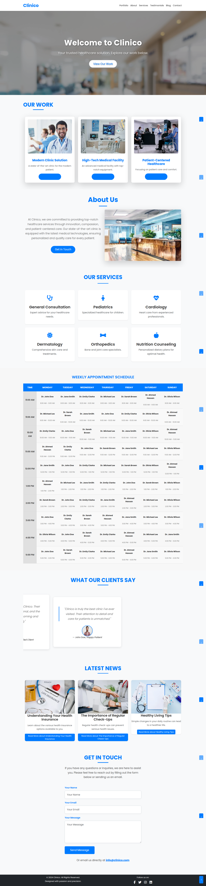

# Clinico - Premium Medical Portfolio Theme

A modern, responsive medical portfolio theme designed for healthcare professionals, clinics, and medical practices. Built with Bootstrap 5 and modern web technologies.



## Features

- 🏥 Modern and Professional Design
- 📱 Fully Responsive Layout
- 🎨 Clean and Minimalist Interface
- ⚡ Optimized Performance
- 🔍 SEO Friendly Structure

## Key Sections

1. **Hero Section**
   - Engaging welcome message
   - Call-to-action button
   - Full-width background image

2. **Portfolio Showcase**
   - Medical facility gallery
   - Project details modal
   - High-quality images

3. **About Section**
   - Company overview
   - Mission statement
   - Team introduction

4. **Services**
   - General Consultation
   - Pediatrics
   - Cardiology
   - Dermatology
   - Orthopedics
   - Nutrition Counseling

5. **Testimonials**
   - Patient reviews
   - Success stories
   - Trust indicators

6. **Blog Section**
   - Health articles
   - Medical news
   - Expert advice

7. **Contact Form**
   - Easy to reach out
   - Location map
   - Contact information

## Technologies Used

- HTML5
- CSS3
- Bootstrap 5
- JavaScript
- Font Awesome Icons
- Tiny Slider
- Google Fonts

## File Structure

```
clinico-portfolio-theme/
├── css/
│   └── style.css
├── fonts/
│   └── fontawesome/
├── images/
│   ├── portfolio/
│   └── blog/
├── js/
│   └── main.js
├── vendor/
│   ├── bootstrap/
│   └── tinyslider/
└── index.html
```

## Browser Support

- Chrome (latest)
- Firefox (latest)
- Safari (latest)
- Edge (latest)
- Opera (latest)

## Credits

- Bootstrap Framework
- Font Awesome Icons
- Tiny Slider
- All images are optimized for web use

## License

This theme is licensed under the [MIT License](LICENSE). 